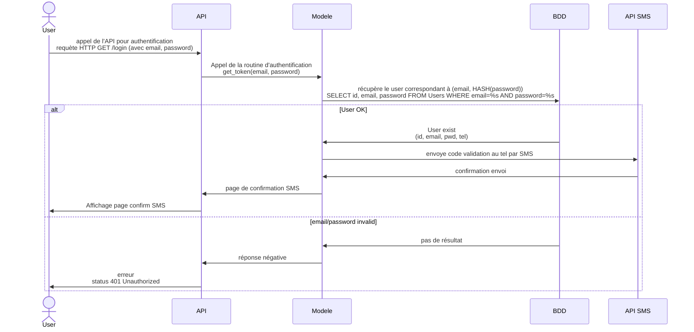

# IoT
## Liste des objets connectés autours de vous
-Porte de la fab
-montre
-portable
-aspirateur robot
-lave linge
-sèche linge
-ordinateur / tablette
-chauffage / thermostat
-store
-cigarette électronique
-voiture
-moto
-gourde
-vélo
-console jeux
-bague
-balance
-chaussure / semelle
-lunette
-vêtements
-fourchette

## Les Diagrammes

## Node-RED

"msg.payload : Object
{"time":"2017-11-19T15:09:03.120Z","latitude":-21.5167,"longitude":168.5426,"depth":14.19,"mag":6.6,"magType":"mww","gap":21,"dmin":0.478,"rms":0.86,"net":"us","id":"us2000brgk","updated":"2017-11-19T17:10:58.449Z","place":"68km E of Tadine, New Caledonia","type":"earthquake","horizontalError":6.2,"depthError":2.8,"magError":0.037,"magNst":72,"status":"reviewed","locationSource":"us","magSource":"us"}"

- Dashboard

  

  [
    {
        "id": "3526f40807e3641f",
        "type": "inject",
        "z": "db34ca51dcba1b91",
        "name": "",
        "props": [
            {
                "p": "payload"
            },
            {
                "p": "temperature",
                "v": "",
                "vt": "num"
            }
        ],
        "repeat": "0.0001",
        "crontab": "",
        "once": true,
        "onceDelay": 0.1,
        "topic": "",
        "payload": "",
        "payloadType": "date",
        "x": 170,
        "y": 160,
        "wires": [
            [
                "0645a06aeaa10201"
            ]
        ]
    },
    {
        "id": "0645a06aeaa10201",
        "type": "function",
        "z": "db34ca51dcba1b91",
        "name": "function 1",
        "func": "msg.payload = Math.random() * (35 - 1) + 0;\nmsg.payload = Math.round(msg.payload);\nreturn msg;",
        "outputs": 1,
        "timeout": 0,
        "noerr": 0,
        "initialize": "",
        "finalize": "",
        "libs": [],
        "x": 380,
        "y": 160,
        "wires": [
            [
                "53b342c7722980ba",
                "786472b4fac6ca44"
            ]
        ]
    },
    {
        "id": "53b342c7722980ba",
        "type": "debug",
        "z": "db34ca51dcba1b91",
        "name": "debug 1",
        "active": true,
        "tosidebar": true,
        "console": false,
        "tostatus": false,
        "complete": "temperature",
        "targetType": "msg",
        "statusVal": "",
        "statusType": "auto",
        "x": 560,
        "y": 160,
        "wires": []
    },
    {
        "id": "786472b4fac6ca44",
        "type": "ui_gauge",
        "z": "db34ca51dcba1b91",
        "name": "",
        "group": "fd6ecdf3fad21a78",
        "order": 0,
        "width": 0,
        "height": 0,
        "gtype": "gage",
        "title": "gauge",
        "label": "°C",
        "format": "{{value}}",
        "min": 0,
        "max": "35",
        "colors": [
            "#00b500",
            "#e6e600",
            "#ca3838"
        ],
        "seg1": "",
        "seg2": "",
        "diff": false,
        "className": "",
        "x": 570,
        "y": 260,
        "wires": []
    },
    {
        "id": "fd6ecdf3fad21a78",
        "type": "ui_group",
        "name": "Default",
        "tab": "9734a0d0554fade6",
        "order": 1,
        "disp": true,
        "width": 6,
        "collapse": false,
        "className": ""
    },
    {
        "id": "9734a0d0554fade6",
        "type": "ui_tab",
        "name": "Home",
        "icon": "dashboard",
        "disabled": false,
        "hidden": false
    }
]

