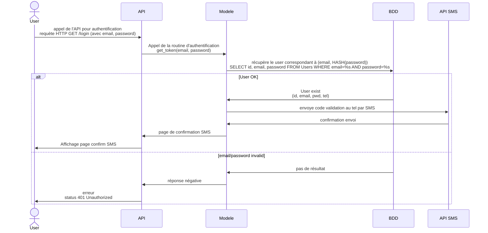

# IoT
## Liste des objets connectés autours de vous
-Porte de la fab
-montre
-portable
-aspirateur robot
-lave linge
-sèche linge
-ordinateur / tablette
-chauffage / thermostat
-store
-cigarette électronique
-voiture
-moto
-gourde
-vélo
-console jeux
-bague
-balance
-chaussure / semelle
-lunette
-vêtements
-fourchette

## Les Diagrammes

## Node-RED

-Earthquake

- Dashboard

  

  

  
